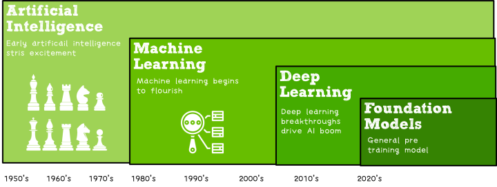
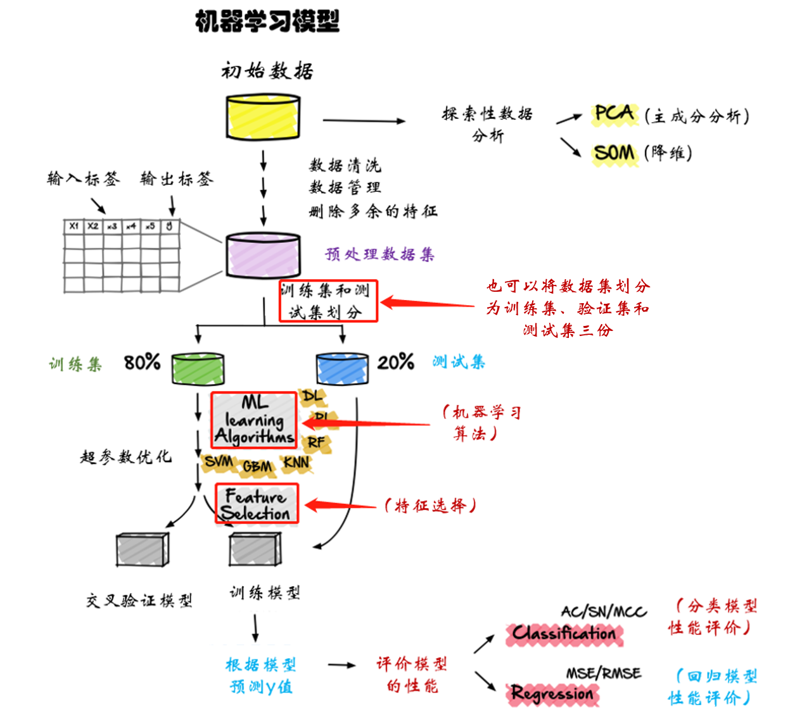
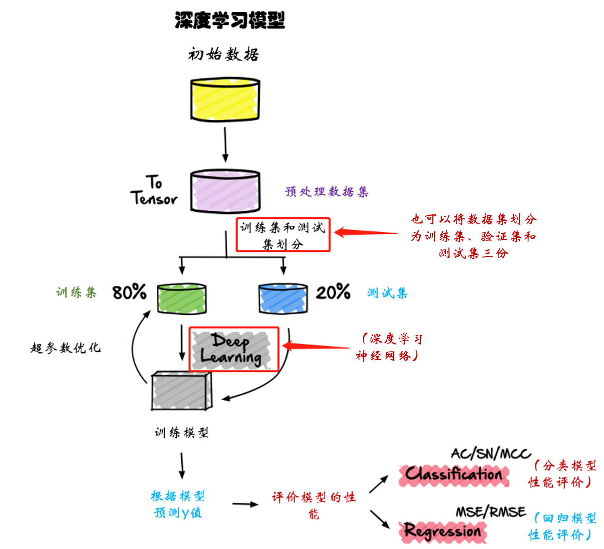

# 人工智能
> book : https://ai.wangyaqi.cn/

>  真正难题在于理解自然智能的工作原理。我们知道，大脑中含有上百亿个神经元，我们的思考和学习是通过在不同的神经元之间建立电子连接来完成的。但是我们并不知道这些连接如何实现高级的推理能力。
> 过去10年我们一直在做一件事，那就是打造移动优先的世界。而在接下来的10年时间里，我们将转到一个AI优先的世界。——Google CEO Sundar Pichai，2016年10月

## 概要
* [人工智能](https://blog.csdn.net/princexiexiaofeng/article/details/89057504)是一门新兴的技术学科，它研究和开发用于模拟人类智能的扩展和扩展的理论、方法、技术和应用系统。
* [人工智能、机器学习、深度学习与神经网络](https://zhuanlan.zhihu.com/p/86794447)

* 分类
    * 传统机器学习：是人类总结的算法，本质和深度学习训练出来的算法模型是一样的。模型有：逻辑回归、决策树、随机森林、[支持向量机SVM](https://www.zhihu.com/question/21094489)、K近邻算法（K-Nearest Neighbors，KNN）
    * 深度学习：神经网络是深度学习的一种算法。模型有：卷积神经网络（Convolutional Neural Networks，CNN），Transformer

## 算法
机器学习是一种实现人工智能的方法。机器学习相对于深度学习，更适合处理小样本的数据。

### 机器学习
* 根据输入数据的分类
    1. **有监督学习**：有监督学习输入的数据是有标签的数据(假设一个分类任务，你训练用到的数据除了自身的特征，还要标明这个数据的类别，类别就是这个数据的标签)
    1. [**无监督学习**](https://www.baike.com/wiki/%E6%97%A0%E7%9B%91%E7%9D%A3%E5%BC%8F%E5%AD%A6%E4%B9%A0%E7%BD%91%E7%BB%9C)：无监督学习输入的数据是没有标签的数据。
* 根据面向问题的分类
    1. **分类**：一种监督学习问题。说白了就是通过机器学习算法来推理出这个数据属于哪个类别。
    1. **回归**：一种监督学习问题，其中要学习的答案是一个连续值。例如，可为算法提供一条房屋销售及其价格的记录，让它学习如何设定房屋价格。
    1. **聚类**：一种无监督学习问题，其中要学习的结构是一些类似示例的集群。例如，市场细分旨在将客户分组到有类似购买行为的人群中。
    1. **网络分析**：一种无监督学习问题，其中要学习的结构是有关网络中的节点的重要性和作用的信息。例如，网页排名算法会分析网页及其超链接构成的网络，并寻找最重要的网页。

### 深度学习 
* 深度学习是机器学习中一种基于对数据进行表征学习的算法。观测值（例如一幅图像）可以使用多种方式来表示，如每个像素强度值的向量，或者更抽象地表示一系列边、特定形状的区域等。而使用某些特定的表示方法更容易从实例中学习任务（例如人脸识别、面部表情识别）。
* 深度学习的好处是用非监督式或半监督式的特征学习和分层特征提取高效算法来替代手工获取特征。（深度学习最重要的就是使用了深度学习神经网络）
* 深度学习神经网络有卷积神经网络 (CNN)、深度置信网络 (DBN)、受限玻尔兹曼机 (RBM)、递归神经网络 (RNN & LSTM & GRU)、递归张量神经网络 (RNTN)、自动编码器 (AutoEncoder)、生成对抗网络 (GAN)等等。上面对于机器学习任务的分类，对深度学习也同样适用。

### 强化学习
* 强化学习 (Reinforcement learning,  RL) 是机器学习中的一个领域，强调如何基于环境而行动，以取得最大化的预期利益；其灵感来源于心理学中的行为主义理论，即有机体如何在环境给予的奖励或惩罚的刺激下，逐步形成对刺激的预期，产生能获得最大利益的习惯性行为。强化学习不仅仅是一个人工智能术语，它是许多领域中的一个中心思想。其主要目的就是**如何优化决策以得到最佳结果**。
* 通过与环境交互来学习行为策略的方法：智能体（agent）通过采取行动（actions）从环境（environment）中获得奖励（rewards），并根据奖励调整其策略（policy）以最大化累积奖励。
* 组成
    1. 智能体：强化学习的本体，作为学习者或者决策者；
    1. 环境：强化学习智能体以外的一切，主要由状态集合组成；
    1. 状态：一个表示环境的数据，状态集则是环境中所有可能的状态；
    1. 动作：智能体可以做出的动作，动作集则是智能体可以做出的所有动作；
    1. 奖励：智能体在执行一个动作后，获得的正/负反馈信号，奖励集则是智能体可以获得的所有反馈信息；
    1. 策略：强化学习是从环境状态到动作的映射学习，称该映射关系为策略。通俗的理解，即智能体如何选择动作的思考过程称为策略；
    1. 标：智能体自动寻找在连续时间序列里的最优策略，而最优策略通常指最大化长期累积奖励。在此基础上，智能体和环境通过状态、动作、奖励进行交互的方式为：智能体执行了某个动作后，环境将会转换到一个新的状态，对于该新的状态环境会给出奖励信号（正奖励或者负奖励）。随后，智能体根据新的状态和环境反馈的奖励，按照一定的策略执行新的动作。

### 迁移学习
* 迁移学习 (Transfer Learning) 就是把已学训练好的模型参数迁移到新的模型来帮助新模型训练。考虑到大部分数据或任务是存在相关性的，所以通过迁移学习我们可以将已经学到的模型参数（也可理解为模型学到的知识）通过某种方式来分享给新模型从而加快并优化模型的学习效率不用像大多数网络那样从零学习。
* 迁移学习是机器学习技术的一种，其中在一个任务上训练的模型被重新利用在另一个相关的任务上，迁移学习也是一种优化方法，可以在对另一个任务建模时提高进展速度或者是模型性能。

## 模型
### 训练
* 一个算法模型从设计到完成训练所经历的整个流程
* 深度学习模型训练与机器学习训练模型的主要不同点：
    1. 深度学习不需要自己去提取特征，而是通过神经网络自动对数据进行高维抽象学习。
    1. 引入了更加深、更复杂的网络模型结构，所以调参工作变得更加繁重(定义神经网络模型结构、确认损失函数、确定优化器，反复调整模型参数)。
* 机器学习模型训练

* 深度学习模型训练

### 评价指标
模型训练出来以后，并不意味着整个训练的流程就已经结束了，接下来要考虑的是这个模型是否达到了训练的预期，因此需要有一些指标来衡量模型的效果。而针对于不同的模型，有着不同的评价指标。

### 部署