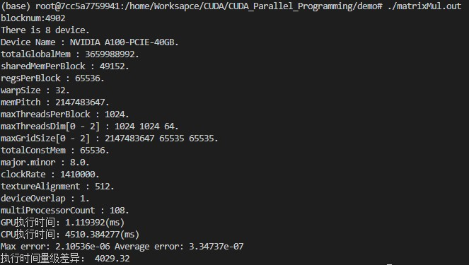
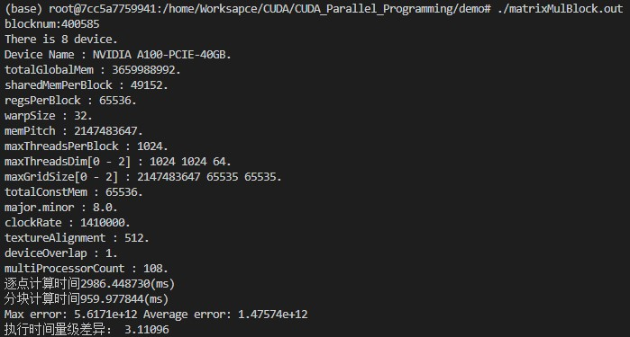

# CUDA并行编程实例
本例通过具体的高维矩阵乘法实例，分别实现基于CPU串行编程和GPU并行编程进行实践和性能对比。

## 运行环境
OS： 20.4.1-Ubuntu

CPU：Intel(R) Xeon(R) Gold 6330 CPU @ 2.00GHz

GPU：NVIDIA A100-PCIE-40GB

CUDA版本：11.6

编译器版本：cl :v19.29.30133; NVCC: Cuda compilation tools, release 11.4, V11.4.120

## 内容
使用 CUDA 编程模型并行计算高维浮点型矩阵乘法，研究 GPU 与 CPU 效率的比较，分析不同编程模型和GPU线程分块对任务执行性能的影响。

* [matrixMul.cu](https://github.com/andrewwang79/book-ai/blob/main/cuda/src/matrixMul.cu) : 浮点型矩阵相乘（逐点计算型）
* [matrixMulBlock.cu](https://github.com/andrewwang79/book-ai/blob/main/cuda/src/matrixMulBlock.cu) : 浮点型矩阵相乘（分块计算型）

## 运行指令
```
nvcc -o matrixMul.out matrixMul.cu
./matrixMul.out
```

## 结果
1. CPU VS GPU(n=1000)
    
1. 逐点 VS 分块(n=10000)
    