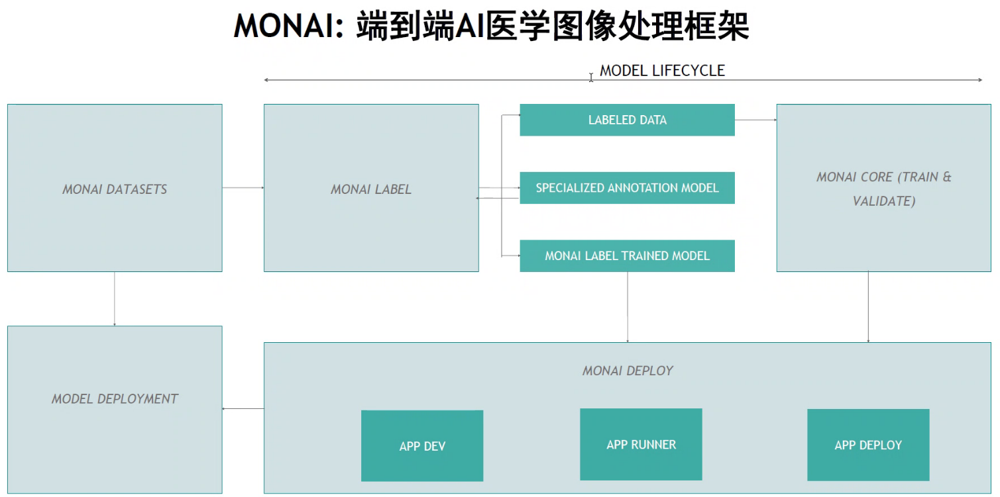
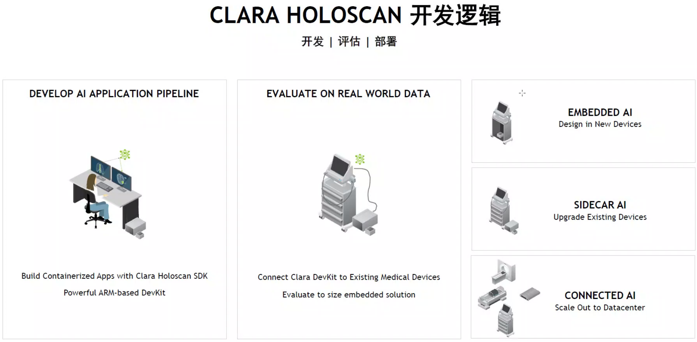
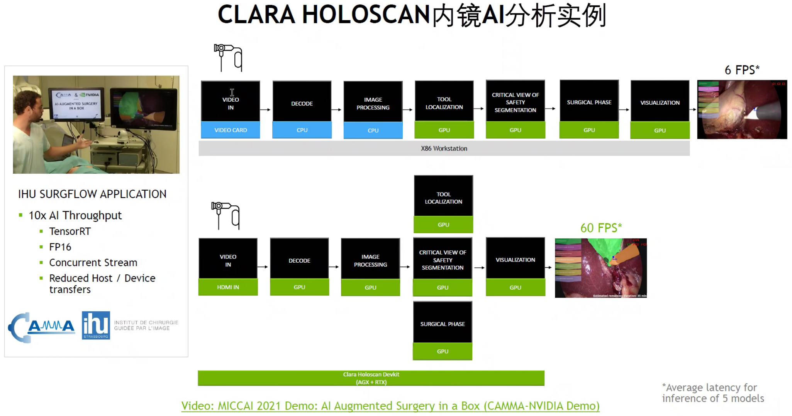
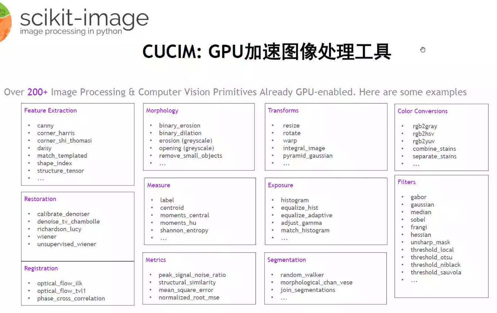

# 生态

## 框架服务
| 项 | 说明 |
| :-: | - |
| PyTorch，TensorFlow | 深度学习框架 |
| TensorRT | 基于CUDA的加速模型推理的框架，优化了由其他框架（Pytorch、TensorFlow、MXNet）训练的人工智能深度学习模型的推理时间和GPU使用率。TensorRT还支持不同精度的推理（例如：INT8和FP16），可以降低延迟。 |
| Triton | Triton Inference Server，部署管理服务 |
| [CNStream](https://github.com/Cambricon/CNStream/blob/master/docs/release_document/latest/Cambricon-CNStream-User-Guide-CN-vlatest.pdf) | 寒武纪的推理框架 |
| [MONAI](http://www.cww.net.cn/article?id=480005) | Medical Open Network for AI。PyTorch-based framework for deep learning in healthcare imaging |
| [NVIDIA CLARA](https://developer.nvidia.com/clara)  | 基于MONAI的医疗健康行业的智能计算平台，https://blog.csdn.net/qq_19765635/article/details/108798962 |
| [NVIDIA CLARA HOLOSCAN](https://www.nvidia.cn/clara/medical-devices/) | 医疗设备的人工智能计算平台 |
| [GStreamer](https://www.cnblogs.com/xleng/p/10948838.html) | 流媒体处理框架，RTSP/RTMP等流媒体网络传输协议  |
| [DeepStream](https://blog.csdn.net/Tosonw/article/details/104154090) | 基于GStreamer的NVIDIA框架，应用于视觉整个流程的解决方案，覆盖视频编解码、图像推理，画面显示等。采用pipeline的模块化插件，每个插件代表一个功能块。 |
| [NVIDIA Jetson](https://baike.baidu.com/item/NVIDIA%20Jetson/23623742) | 适用于自主机器的嵌入式系统  |

## 库
| 项 | 说明 |
| :-: | - |
| [CUDA](https://devblogs.nvidia.com/even-easier-introduction-cuda/) | 通用并行计算，是GPU的封装库。类似的有工业标准OpenCL。用于AI算子插件开发 |
| [cuCIM](https://www.quansight.com/post/performance-for-image-processing-with-cucim) | NVIDIA的scikit-image的GPU版本. provide GPU-accelerated I/O, computer vision and image processing primitives for N-Dimensional images with a focus on biomedical imaging |
| scikit-image | C++数字图像处理库，使用Python接口。类似OpenCV，ITK |
| [DALI](https://github.com/NVIDIA/DALI) | NVIDIA Data Loading Library，基于Python，训练用 |
| [RAPIDS](https://rapids.ai/) | Open GPU Data Science，各种科学库，比如cuCIM，https://docs.rapids.ai/api |
| [RTK](http://www.openrtk.org/) | 基于ITK包扩展出CBCT重建算法包 |
| [cuMath](https://crates.io/crates/cumath/) | cuda wrapper for Rust，Cuda-based matrix/vector computations |
| FFmpeg/live555 | 视频编解码，H264 |
| NVIDIA CLOUDXR | XR的SDK |
| NVIDIA Omniverse | 计算机图形与仿真模拟平台 |

## MONAI
* https://docs.monai.io/en/latest/highlights.html

## holoscan

## CUDA
* [CUDA编程入门极简教程](https://zhuanlan.zhihu.com/p/34587739)

## cuCIM

## RAPIDS
* [RAPIDS](https://www.nvidia.cn/deep-learning-ai/software/rapids/) : 基于GPU的机器学习Python库, [资料](https://www.datalearner.com/blog/1051562381920769)
* 数据科学和分析流程，以及一些传统的经典机器学习算法
* 三个模块处理数据：cuDF相当于Pandas，cuML相当于scikit-learn，cuGraph则是处理图数据的（如PageRank算法）

## Sklearn
* Python机器学习库，https://mofanpy.com/tutorials/machine-learning/sklearn/

## 资料
* 在CPU和GPU之间传输数据，CPU负责主程序，GPU负责密集计算。
* [PIL,Skimage,OpenCV](https://blog.csdn.net/qq_43258953/article/details/101154116)
* [使用 MONAI 和 Triton 高效构建和部署 GPU 加速的医疗影像推理流程](https://mp.weixin.qq.com/s/HeD4QwrTJyPcxmNnw2z5fQ)
* [流媒体](https://tech.wangyaqi.cn/#/common/streammedia)
