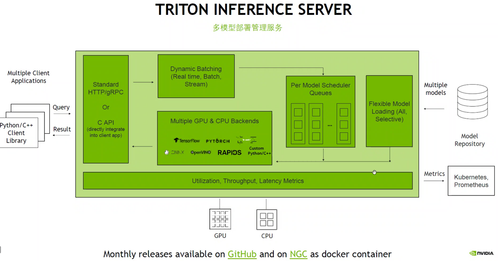

# Triton

## 集成使用
* [quickstart](https://github.com/triton-inference-server/server/blob/main/docs/quickstart.md)

## 资料
* [GPU Direct RDMA](https://developer.aliyun.com/article/603617):
  * 服务器1的网卡可以直接读写服务器2的内存
  * 远程内存读写：发送RDMA读写操作到远程服务器(含远程服务器的虚拟内存地址)，远程应用程序在其本地网卡中注册相应的内存缓冲区。整个RDMA数据传输过程中远程服务器CPU只用于连接建立、注册调用。
