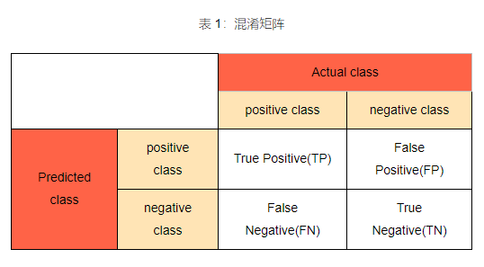

# 知识

* [人工智能、机器学习、深度学习与神经网络](https://zhuanlan.zhihu.com/p/86794447)
* [寒武纪课程](https://developer.cambricon.com/index/curriculum/index/classid/7.html)

## 基础知识
* 最小二乘法：最小平方
* [信息熵](http://baike.baidu.com/item/%E4%BF%A1%E6%81%AF%E7%86%B5)：系统有序化程度，越有序越低
* [标量、向量、矩阵、张量](https://easyai.tech/ai-definition/scalar/)
* 

## 机器学习
* **[斯坦福大学公开课 ：机器学习课程_全20集](http://open.163.com/special/opencourse/machinelearning.html)**
* [初学者必读：从迭代的五个层面理解机器学习](http://it.sohu.com/20161229/n477271597.shtml)
* [数据分析扫盲 -- 1.传统数据分析](https://www.zybuluo.com/heavysheep/note/636770)
* [数据分析扫盲 -- 2.机器学习](https://www.zybuluo.com/heavysheep/note/639120)

## 深度学习
* [2016年不可错过的21个深度学习视频、教程和课程](https://zhuanlan.zhihu.com/p/24362823?utm_source=wechat_session&utm_medium=social)
* [初学者入门指南：深度学习的五级分类](http://www.dlworld.cn/ShenDuXueXiYingYong/2764.html)
* [程序员实用深度学习免费课程：从入门到实践](http://it.sohu.com/20161229/n477271598.shtml)
* [九本不容错过的深度学习和神经网络书籍](http://it.sohu.com/20161229/n477271599.shtml)
* [2016AI巨头开源IP盘点 50个最常用的深度学习库](https://news.cnblogs.com/n/559753/)

## 神经网络
* [卷积神经网络CNN](https://www.zhihu.com/question/34681168)
