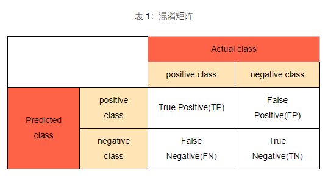

# 基础知识
* 最小二乘法：最小平方
* [方差标准差协方差](https://www.cnblogs.com/xunziji/p/6772227.html)
* [信息熵](http://baike.baidu.com/item/%E4%BF%A1%E6%81%AF%E7%86%B5)：系统有序化程度，越有序越低
* [标量、向量、矩阵、张量](https://easyai.tech/ai-definition/scalar/)
* [梯度与法向量](https://zhuanlan.zhihu.com/p/62718992), [法向量](https://baike.baidu.com/item/%E6%B3%95%E5%90%91%E9%87%8F/1161324)
* 卷积
* [概率密度函数](https://www.zhihu.com/question/263467674)

## 距离
* [Hausdorff distance 豪斯多夫距离](https://blog.csdn.net/lijiaqi0612/article/details/113925215)
* [汉明距离（Hamming Distance）](https://blog.csdn.net/hy592070616/article/details/122272472) : 两个（相同长度）字符串对应位不同的数量。

## 混淆矩阵(Confusion Matrix)

* https://cloud.tencent.com/developer/article/1527943, https://blog.csdn.net/Orange_Spotty_Cat/article/details/80520839

>precision=查准率
灵敏度=recall，查全率
查准率=选出的样本中有多少比例样本是正例（期望样本）
查全率=有多少比例的正样本（期望样本）被选出来了

*指标分母=0的结果，逻辑参考自sklearn

| 指标 | 结果 | 场景 |
| :-: | - | - |
| 准确率 | 0 | 没有数据 |
| 精确率 | 0 | 没有预测的阳性数据 |
| 灵敏度 | 0 | 没有真实的阳性数据 |
| 特异度 | 0 | 没有真实的阴性数据 |

### ROC和AUC(Area under Curve)
* ROC是曲线，AUC是ROC曲线下的面积
* https://www.cnblogs.com/dlml/p/4403482.html
