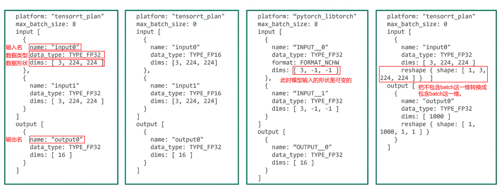

# 模型仓库配置文档
在说明模型的基本配置参数之前，首先解释一下各种状态的模型：

- 无状态模型： 就是指一个单一的推理模型。
- 有状态模型： 多个模型间的组合模型。
- 组队模型： 时序类模型（当前一刻的状态依赖于前一时刻的状态）。

## 基本模型配置参数
最基本的模型配置必须要有如下参数：

- **指定平台/或Backend(后端)**
- **max_batch_size:** 模型支持的最大batch大小，对于不支持批处理的模型必须设置为0
- **输入输出张量:**  每个模型的输入和输出都必须指定名称、数据类型和形状。为输入或输出张量指定的名称必须与模型预期的名称相匹配。

下面是一个具有两个输入input0 和input1和一个输出output0 的TensorRT模型，所有这些都是 16 个entry float32 张量,那它的最基本的配置文件如下：

```json
platform: "tensorrt_plan"    //指定平台或后端 
max_batch_size: 8            //模型支持的最大batch大小，对于不支持批处理的模型必须设置为0
  input [                    //输入张量
    {
      name: "input0"
      data_type: TYPE_FP32
      dims: [ 16 ]
    },
    {
      name: "input1"
      data_type: TYPE_FP32
      dims: [ 16 ]
    }
  ]
  output [                   //输出张量
    {
      name: "output0"
      data_type: TYPE_FP32
      dims: [ 16 ]
    }
  ]
```

### （1）Backend
Triton后端是执行模型的实现。后端可以是深度学习框架的封装，例如 PyTorch、TensorFlow、TensorRT、ONNX Runtime 或 OpenVINO。后端也可以实现想要的任何功能，只要它遵循后端API。Triton 使用此API 将请求发送到后端执行，后端使用 API 与 Triton 进行通信。

每个模型都必须与后端相关联。通过设置platform或者backend这两个参数，能够说明模型是在那种backend上运行的。

**下面是不同模型后端参数的设置**

以下下三种模型在配置文件中只需声明platform或者backend就可以了。

|          | TensorRT      | ONNX RT          | Pytorch          |
| -------- | ------------- | ---------------- | ---------------- |
| platform | tensorrt_plan | onnxruntime_onnx | pytorch_libtorch |
| backend  | tensorrt      | onnxruntime      | pytorch          |

下面几种模型需要根据具体情况进行参数配置。

|          | Tensorflow                                 | Open VINO | Python | DALI | Custom          |
| -------- | ------------------------------------------ | --------- | ------ | ---- | --------------- |
| platform | tensorflow_graphdef/ tensorflow_savedmodel |           |        |      | custom          |
| backend  | tensorflow                                 | openvino  | python | dali | \<backend_name> |

- Tensorflow模型必须在配置文件中声明 platform是tensorflow_graphdef还是tensorflow_savedmodel (backend的配置可有可无)。
- Open VINO,Python,DALI必须要声明backend(因为其并没有platform参数)。
- Custom在21.05之前可以设置platform来进行配置，但后续版本必须使用backend。

### （2）max_batch_size 和输入和输出
- max_batch_size的设置是为了限制在模型推理的时候不会超过GPU/CPU的显存或内存。

之所以把max_batch_size和输入输出放在一起是因为它们是有关联的。下面就做详细阐述。



上图是几种不同情况下的模型配置参数。

- **当max_batch_size > 0 时**：输入和输出的dims是不需要指定batch_size这一维的。在这种情况下，triton默认batch_size这一维是可变的。因此只需要指定batch_size后面的几维。
- **当max_batch_size = 0 时**：此时模型的输入输出是不包含batch_size这一维的。上图中第二个参数配置文件就是max_batch_size = 0。此时这个模型的输入和输出就不支持batch操作，想要其支持batch操作，可以在dims中添加batch的参数，假如此时想让输入变成一次两个batch，那么dims就要修改为dims：     [ 2, 3, 224, 224]。如果模型输入的尺寸是可变的，可以将可变的那一维参数设置为-1，即dims：[ 2, 3, -1, -1]。
- **对于pytorch模型**：python的模型文件中，是不包含输入和输出的过多信息的, 因此pytorch模型的输入和输出必须遵循某种特定的格式。其输入和输出的名称必须由一个字符串+两个下划线(_)+一个数字构成。
- **reshape的应用**：reshape可以将输入的tensor给转换成想要的维度。

## 其它模型配置参数 

### （1）默认最大批处理大小和动态批处理器

当模型使用自动完成功能时，可以使用--backend-config=default-max-batch-size=(最大批量大小) 命令行参数设置默认的最大批量大小，该命令的**默认值为4。**

后端开发人员可以通过从 **TRITONBACKEND_BackendConfig** api 获取这个 default-max-batch-size 来进行使用。

目前支持的后端有：

- TensorFlow Backend

- Onnxruntime Backend

- TensorRT Backend
  - TensorRT 模型明确存储最大批量大小，并且不使用 default-max-batch-size 参数。

### （2）数据类型
Triton支持的张量数据类型如下表。

- 第一列是**模型配置文件**中的数据类型名称
- TensorRT到Pytorch这四列是支持的框架对应的数据类型，如果表中为空，表示Triton不支持该模型的该数据类型。
- “API”这一列显示了 TRITONSERVER C API、TRITONBACKEND C API、HTTP/REST 协议和 GRPC 协议的相应数据类型。
- 最后一列显示了 Python numpy 库的相应数据类型。

| 模型配置    | TensorRT | TensorFlow | ONNX Runtime | PyTorch | API    | NumPy         |
| ----------- | -------- | ---------- | ------------ | ------- | ------ | ------------- |
| TYPE_BOOL   | kBOOL    | DT_BOOL    | BOOL         | kBool   | BOOL   | bool          |
| TYPE_UINT8  |          | DT_UINT8   | UINT8        | kByte   | UINT8  | uint8         |
| TYPE_UINT16 |          | DT_UINT16  | UINT16       |         | UINT16 | uint16        |
| TYPE_UINT32 |          | DT_UINT32  | UINT32       |         | UINT32 | uint32        |
| TYPE_UINT64 |          | DT_UINT64  | UINT64       |         | UINT64 | uint64        |
| TYPE_INT8   | kINT8    | DT_INT8    | INT8         | kChar   | INT8   | int8          |
| TYPE_INT16  |          | DT_INT16   | INT16        | kShort  | INT16  | int16         |
| TYPE_INT32  | kINT32   | DT_INT32   | INT32        | kInt    | INT32  | int32         |
| TYPE_INT64  |          | DT_INT64   | INT64        | kLong   | INT64  | int64         |
| TYPE_FP16   | kHALF    | DT_HALF    | FLOAT16      |         | FP16   | float16       |
| TYPE_FP32   | kFLOAT   | DT_FLOAT   | FLOAT        | kFloat  | FP32   | float32       |
| TYPE_FP64   |          | DT_DOUBLE  | DOUBLE       | kDouble | FP64   | float64       |
| TYPE_STRING |          | DT_STRING  | STRING       |         | BYTES  | dtype(object) |
| TYPE_BF16   |          |            |              |         | BF16   |               |

### （3）Reshape
在input中，reshape可将输入的张量重塑为框架(或后端)想要的形状。常见的场景是支持批处理的模型想要一个具有形状[batch-size]的输入，这要求批处理维度完全描述了形状。而对于推理的API，其形状必须相同[batch-size, 1]，因为每个输入都必须指定一个非空的dims。在这种情况下，input要这样写：

```json
 input [
    {
      name: "in"
      dims: [ 1 ]
      reshape: { shape: [ ] }
    }
    ...
  ]
```

在output中，
对于输出，reshape可用于将框架或后端生成的输出张量重塑为推理 API 返回的不同形状。一个常见的用例是支持批处理的模型期望批处理输出具有形状[batch-size]，这意味着批处理维度完全描述了形状。对于推理 API，必须指定等效形状[batch-size, 1]， 因为每个输出都必须指定一个非空的 dim。

```json
  output [
    {
      name: "in"
      dims: [ 1 ]
      reshape: { shape: [ ] }
    }
        ...
  ]
```

### （4）Version Policy(版本使用规则)
当我们模型仓库中的同一个模型有多个版本时，可以使用**version_policy**属性进行管理。该属性共有一下三个参数：

- all：模型仓库中所有版本的模型都可以用来推理。**version_policy: { all: {}}**
- Latest：只有模型仓库中最新的”n“个版本的模型可以用来推理(在模型的仓库中，默认数字越大版本越新)。**version_policy: { latest: { num_versions: 2}}**
- Specific：指定模型仓库中的某些版本进行推理。**version_policy: { Specific: {versions: [1,3]}}**

注：如果没有指定要使用哪个版本的模型，Triton会默认使用最新的版本。

```json
  platform: "tensorrt_plan"
  max_batch_size: 8
  input [
    {
      name: "input0"
      data_type: TYPE_FP32
      dims: [ 16 ]
    },
    {
      name: "input1"
      data_type: TYPE_FP32
      dims: [ 16 ]
    }
  ]
  output [
    {
      name: "output0"
      data_type: TYPE_FP32
      dims: [ 16 ]
    }
  ]
  version_policy: { all { }}
  version_policy: { latest: { num_versions: 2}}
  version_policy: { Specific: {versions: [1,3]}}  // 三选一
```

在liunx中要指定版本可以通过 -x 版本号来实现。

### （5）instance group(实例组)
Triton 可以提供模型的多个实例，以便可以同时处理该模型的多个推理请求。

合理设置该参数可以提高GPU的利用率，增加模型的吞吐。

默认情况下，为系统中可用的每个GPU创建模型的单个执行实例。实例组设置可用于在每个GPU上或仅在某些GPU上放置模型的多个执行实例(官方描述)。

如果要在系统GPU上放置模型的两个执行实例，配置文件要这样写：

```json
  instance_group [
    {
      count: 2           // 实例数
      kind: KIND_GPU     // 使用CPU(KIND_CPU)还是GPU
    }
  ]
```

在instance_group上可以指定多组group,分别跑在不同的设备上。此时配置文件如下所示：

```json
  instance_group [
    {
      count: 1
      kind: KIND_GPU
      gpus: [ 0 ]      // 指定GPU 0
    },
    {
      count: 2
      kind: KIND_GPU
      gpus: [ 1, 2 ]  // 指定GPU 1, 2
    }
  ]
```

**这里有一点要注意，如果不指定那个GPU,那么Triton会在每个GPU上都跑上相应数量的instance。**当然占用的GPU越多，其性能就越好(强烈不建议这么做)。

### （6）CUDA 计算能力
通过使用cc_model_filenames字段可以在模型加载时将 GPU 的 CUDA 计算能力映射 到相应的模型文件。

**这个字段对于tensorRT模型特别有用，因为它们通常与特定的计算能力相关联**。

```json
cc_model_filenames [
  {
    key: "7.5"
    value: "resnet50_T4.plan"
  },
  {
    key: "8.0"
    value: "resnet50_A100.plan"
  }
]
```

### （7）调度和批处理(Scheduling and Batching)
该参数主要用于指明Triton使用哪一种调度策略，来调度送进来的推理请求。合理使用该参数可以提升GPU的利用率，增加吞吐。

**下面是官方对该参数的描述：**

Triton 通过允许单个推理请求指定一批输入来支持批量推理。同时执行一批输入的推理，这对于 GPU 尤其重要，因为它可以大大提高推理吞吐量。在许多用例中，单个推理请求没有被批处理，因此，它们无法从批处理的吞吐量优势中受益。

推理服务器包含多种调度和批处理算法，支持许多不同的模型类型和用例。

#### 默认程序调度
如果模型配置中未指定任何scheduling_choice属性，则默认调度程序用于模型。默认调度程序只是将推理请求分发到为模型配置的所有模型实例。

#### 动态批处理器
通过dynamic_batching参数可以设置 动态创建的批处理的首选大小、请求可以在调度程序中延迟以允许其他请求加入动态批处理的最长时间，以及队列属性(队列大小，优先级和超时)。

```json
 dynamic_batching {
    preferred_batch_size: [ 4, 8 ], //指定首选批量大小  期望达到的batch_size是多少，可以是一个数，也可以是一个数组。通常设置多个值
    max_queue_delay_microseconds: 100, //延迟批处理，将请求的最大延迟设置为100微秒 
  }

preserve_ordering //作用 推理结果返回的顺序和推理请求发送的顺序完全一致
priority_levels   //作用 定义不同优先级的请求处理的顺序
Queue_Policy      //作用 指定请求等待队列的行为（队列大小、优先级和超时）
```

动态批处理是 Triton 的一项功能，通过服务器组合推理请求，从而动态创建批处理。创建一批请求通常会导致吞吐量增加。动态批处理器应该用于无状态模型。动态创建的批次分布到为模型配置的所有模型实例 。

在服务端，将多个batch_size比较小的request组合在一起，拼成一个batch_size的比较大的input tensor,从而提升GPU的利用率。但是并不适用于视频流的模型和音频流的模型。

**nvidia官方推荐的配置过程如下：**

1. 确定模型的最大批处理量大小
2. 添加 dynamic_batching { }参数以启用默认设置的动态批处理器。默认情况下，动态批处理器将创建尽可能大的批次，直到最大批次大小，并且在形成批次时不会延迟。
3. 使用性能分析器确定默认动态批处理器配置提供的延迟和吞吐量。
4. 如果默认配置导致延迟值在您的延迟预算范围内，可以通过以下方法来权衡增加的延迟以增加吞吐量：
   - 增加最大批量大小。
   - 将批处理延迟设置为非零值。尝试增加延迟值直到超过延迟预算以查看对吞吐量的影响。
5. 大多数模型不应使用首选批量大小。仅当该批大小导致性能明显高于其他批大小时，才应配置首选批大小。

#### 序列批处理器
```json
sequence_batching{
    max_sequence_idle_microseconds:5000000
    control_input[
      { name:"START"
    	control[
    	  {  kind: CONTROL_SEQUENCE_START
             int32_false_true: [0, 1]
		  }]
	   },
      {  name:"READY"
    	  control[
    	    { kind: CONTROL_SEQUENCE_READY
              int32_false_true: [0, 1]
		  }]
	   },
      {  name:"END"
    	  control[
    	    { kind: CONTROL_SEQUENCE_END
              int32_false_true: [0, 1]
		  }]
	   },
      {  name:"CORRID"
    	  control[
    	    { kind: CONTROL_SEQUENCE_CORRID
              data_type: TYPE_UINT64
		  }]
	   }
    ]
  oldest{
      max_candidate_sequences:2200
      preferred_batch_size:[256,512]
      max_queue_delay_microseconds:1000
  }
}
```

#### 集成调度器
用于组合其他不同的模块，形成一个pipline

集成调度器必须用于集成模型，不能用于任何其他类型的模型。

### （8）优化策略
Triton提供了两种简单易用的优化手段，分别是针对于ONNX模型和Tensorflow模型。

```json
// ONNX 模型
optimization{
    execution_accelerators{
    	gpu_execution:[{
    		name: "tensorrt"
    		parameters { key: "precision_mode" value: "FP16"}
			parameters { key: "max_workspace_size_bytes" value: "1073741824"}
		}]
	}
}
```

```json
// Tensorflow 模型   使用的是 TF-TRT 本质上仍然是一个Tensorflow模型
optimization{
    execution_accelerators{
    	gpu_execution:[{
    		name: "tensorrt"
    		parameters { key: "precision_mode" value: "FP16"}
		}]
	}
}
```

#### （9）模型热身
有些模型在刚刚初始化的时候，在接收推理请求和执行推理任务的性能并不稳定(可能速度会比较慢)，为了解决这一问题，Triton中引入了一个模型热身的概念，通过指定model_warmup来实现。

```json
model_warmup[
    {
        batch_size: 64   // 使用多大打batch_size来做热身
        name:"warmup_requests" 
        inputs{
        	key: "input"
            value:{
        		random_data: true    //指定热身方式(通过生成随机数来热身)
        		dims: [299, 299, 3]  //指定热身时的输入的形状
				data_type: TYPE_FP32 //指定数据类型
    		}
    	}
    }
]
```

该字段设置完毕后，在Triton初次加载某一个模型的时候，会向模型发送一个热身的请求以达到热身的效果。从clinet端的视角来看，模型在执行热身的时候，是没有被加载进来的。

在热身的过程中，Triton是不能让模型提供服务的，会导致模型加载时间变长，不能及时的响应。

#### （10）响应缓存
模型配置response_cache部分有一个enable布尔值，用于为此模型启用响应缓存。--response-cache-byte-size除了在模型配置中启用缓存外，启动服务器时还必须设置一个非零值。

```json
response_cache {
  enable: True
}
```