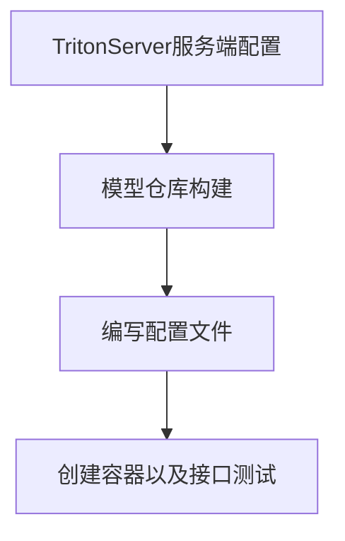

# 深度网络算法部署技术路线调研报告
报告描述：主要针对Triton Server部署模型的整理流程进行了调研，以及速度提升方面的技术调研。
## 问题定义
训练得到的模型主要目的还是为了更有效地解决实际中的问题，因此部署是一个非常重要的阶段！模型部署的优化方向，包括但不仅限于：移植、压缩、加速等。

## 概述
目前主流的深度学习部署平台包含GPU、CPU、ARM。模型部署框架则有英伟达推出的TensorRT，谷歌的Tensorflow和用于ARM平台的tflite，开源的caffe，百度的飞浆，腾讯的NCNN。其中基于GPU和CUDA的TensorRT在服务器，高性能计算，自动驾驶等领域有广泛的应用。如何让深度学习算法在不同的平台上跑的更快，这是深度学习模型部署所要研究的问题。

模型的部署方式是多样的：封装成一个SDK，集成到APP或者服务中；封装成一个web服务，对外暴露接口（HTTP(S)，RPC等协议）。Google早在2016年就针对TensorFlow推出了服务化框架TensorFlow Serving（TFS），能够把TensorFlow模型以web服务的方式对外暴露接口，通过网络请求方式接受来自客户端（Client）的请求数据，计算得到前向推理结果并返回。模型部署的目的是模型服务化，它的核心功能包括：服务框架+前向推理计算。

## 部署依赖项
* TensorRT：为inference（推理）为生，是NVIDIA研发的一款针对深度学习模型在GPU上的计算，显著提高GPU上的模型推理性能。即一种专门针对高性能推理的模型框架，也可以解析其他框架的模型如tensorflow、torch。
* Triton：类似于TensorFlow Serving，但triton包括server和client。triton serving能够实现不同模型的统一部署和服务，提供http和grpc协议，给triton client请求模型推理。

## Triton inferrence Server简介
一款开源推理服务软件，简化AI推理。  
***
同时支持在GPU、x86 和 ARM CPU 或 AWS Inferentia 上跨云、数据中心、边缘和嵌入式设备进行推理。  

能部署来自多个深度学习和机器学习框架的任何AI模型。(TensorRT、TensorFlow、PyTorch、ONNX、OpenVINO、Python、RAPIDS FIL)  
***
## Triton server 结构
### 基本组件
1. 模型仓库（model repository）
   基于文件系统存储要使用的模型仓库。
3. 并发执行
4. 动态批处理
5. Pipeline建模（BLS）
6. 推理协议（HTTP/GRPC）
7. 请求响应调度及批处理
8. 后端C API
9. python/C++库

## Triton部署模型的具体流程

## 模型速度提升的建议
TensorRT可以对网络进行压缩、优化以及运行时部署，并且没有框架的开销。TensorRT通过combines layers，kernel优化选择，以及根据指定的精度执行归一化和转换成最优的matrix math方法，改善网络的延迟、吞吐量以及效率。在模型部署阶段，可以使用TensorRT对模型的速度进行优化。