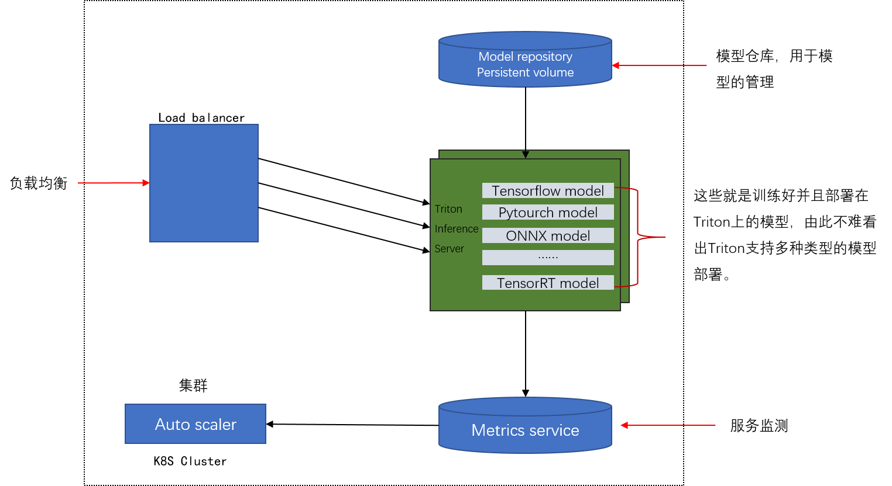

# Triton Inference Server框架
Triton Inference Server 是一款开源推理服务软件，可简化 AI 推理。Triton能够部署多种框架的AI模型(TensorRT、TensorFlow、PyTorch、ONNX、OpenVINO、Python、RAPIDS FIL 等)。Triton 支持在 NVIDIA GPU、x86 和 ARM CPU 或 AWS Inferentia 上跨云、数据中心、边缘和嵌入式设备进行推理。并且Triton 对许多查询类型进行优化(实时、批处理、集成和音频/视频流)。

以上是英伟达官方对于Triton Inference Server的描述。

在了解Triton Inference Server之前，首先明确一个概念，**Triton Inference Server ≠  推理服务**。

Triton Inference Server只是整个推理服务的一部分（也可以说是一个组件）。

## 推理服务是什么？
整个推理服务的结构如下图所示：

其主要分为两个部分，抽象的描述如下图所示：

从Triton Inference Server的名字不难看出，其重点在于服务端，因此，我们先将目光聚焦于服务端。

## Triton Inference Server 在整个架构中占一个什么样的位置？
要想知道其占有一个什么样的位置，首先要了解整个推理服务端的架构。推理服务框架的服务端架构如下图所示：

其中绿色的部分就是Triton Inference Server，从图中可以看出，一个Server端包含多个部分组成，并不单单是Triton Inference Server(Triton Inference Server 只是整个推理架构服务端的一部分)。

这里可以做一个层次关系的总结(由大到小):

层级关系已经明确了，那Triton Inference Server的结构到底是什么样的呢？

Triton Inference Server 的结构如下图：

## Triton Inference Server的特点
- 支持多种框架
- 模型并发执行
- 多线程
- 支持多种传输协议(http gprc)
- K8S
- 模型易于管理
- 能够显示GPU利用率、服务器吞吐量、服务器延迟等指标。